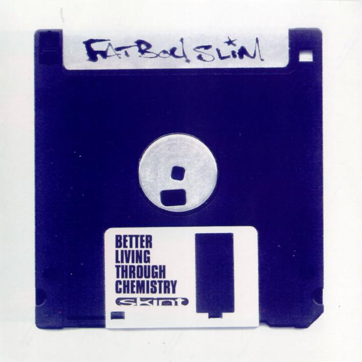
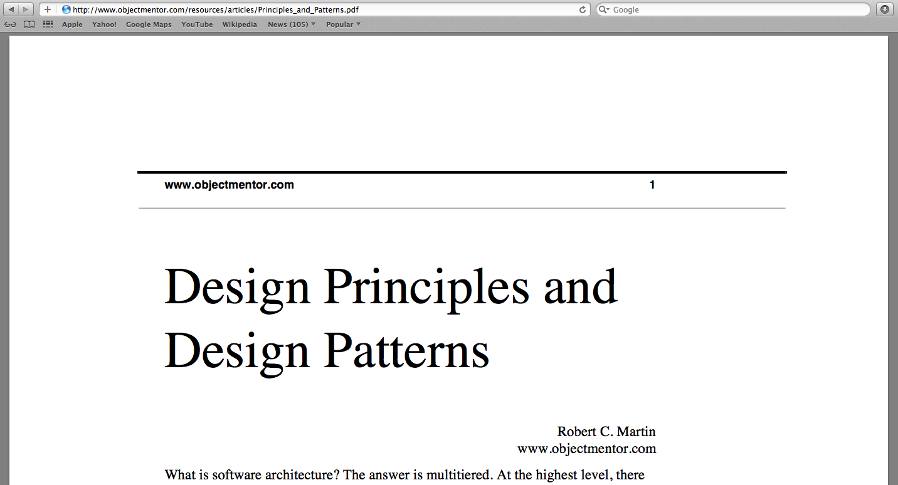
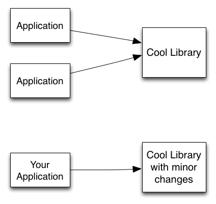

# Better Ruby

!SLIDE

# Better Ruby 
## Through Design Principles*

### Mike Gehard
### [@mikegehard](https://twitter.com/#!/mikegehard)
### [https://github.com/msgehard/Better-Ruby-Through-Design-Patterns](https://github.com/msgehard/Better-Ruby-Through-Design-Patterns)

##### * Bonus points to anyone who can name the musical reference

!SLIDE



!SLIDE bottom-left

# Tech Lead - User Acquisition

}}} images/livingsocial.png

!SLIDE

# "Nothing endures but change." 
#### Heraclitus of Ephesus (c.535 BC - 475 BC)


!SLIDE
#That's great but how does that apply to Ruby?

!SLIDE
#When did you last build an application that didn't change?

!NOTES
  * Apps change because their requirements change
  * If your requirements have never changed then you can stop listening now.

!SLIDE
# How is your app going to adjust to change?

!SLIDE 


!SLIDE

}}} images/remodelChurch.jpg


!SLIDE

#What decides how your app is going to withstand change?

!SLIDE bottom-left

# The design

}}} images/design.jpg::span112::flickr::http://www.flickr.com/people/span112/

!SLIDE


[http://martinfowler.com/bliki/DesignStaminaHypothesis.html](http://martinfowler.com/bliki/DesignStaminaHypothesis.html)

!NOTES
  * There is an inflection point where doing design makes money sense.


!SLIDE bottom-left
# I'm using Rails so I don't need to do design.

}}} images/rails.png

!SLIDE

``` ruby
class Post < ActiveRecord::Base

  has_many :comments
  belongs_to :author

  after_update :alert_updated

  def approve!
    update_attribute(:approved, true)
  end

  def attribute_to(user)
    update_attribute(:author, user)
  end

  private
  def alert_updated
    # tell everyone that the post was updated
    # and what changed via email
  end

  # only 100 more lines of code if you are lucky
  # and you have a lot more classes that look like this

end
```

!NOTES
  * Even when using a framework, you still need to design your business logic.


!SLIDE
#How do you measure the design of your application?

!SLIDE bottom-left
#The interactions between classes (aka dependencies)

}}} images/bonds.jpg::emsl::flickr::http://www.flickr.com/people/emsl/

!NOTES
  * As a class, who do I rely on to get my work done and who relies on me to 
get their work done.

!SLIDE



!NOTES
  * Yes this was originally done in Java
  * Ideas still apply to Ruby


!SLIDE
#SOLID
  * Single Responsibility Principle
  * Open/Closed Principle
  * Liskov Substitution Principle
  * Interface Segregation Principle
  * Dependency Inversion Principle

!NOTES
 Way to objectively judge quality of software

!SLIDE
#Single Responsibiliy Principle
### A class should have one, and only one, reason to change.

!SLIDE
``` ruby

class FileProcessor
  
  def process_file(url)
    file = download_file(url)
    status = parse_file(file)
    report_status(status)
  end

  private 
  def download_file(url)
    # do some downloading stuff
  end

  def parse_file(file)
    # do that parsing stuff you do
  end

  def report_status(status)
    # probably email for now
  end

end

```

!SLIDE

#AND/OR

!SLIDE

#Dependency Inversion Principle 
### Depend on abstractions, not on concretions.

!NOTES
  * In Ruby you build to an protocol/contract

!SLIDE
```ruby

class FileProcessor
  
  def process_file(url)
    file = download_file(url)
    status = parse_file(file)
    report_status(status)
  end

  private 
  def download_file(url)
    # do some downloading stuff
  end

  def parse_file(file)
    # do that parsing stuff you do
  end

  def report_status(status)
    # probably email for now
  end

end

processor.process_file(ftp://foo.com/my_file.pdf)

```

!SLIDE

``` ruby 

class FileProcessor
  def initialize(reporter)
    @downloader = downloader
    @reporter = reporter
  end

  def process_file(url)
    downloader = Downloaders.find(url)
    file = downloder.get
    parser = Parsers.find(file)
    status = parser.parse
    @reporter.report(status)
  end

end

class Downloaders

  class FtpDownloader
    def get
    end
  end

  def self.find(url)
  end

end

class Parsers

  class PdfParser
    def initialize(file) 
      @file = file
    end
    def parse
    end
  end

  def self.find(file)
    return newPdfParser(file)
  end

end

class EmailReporter
  def report(status)
  end
end

processor = FileProcessor(new EmailReporter)
processor.process_file(ftp://foo.com/my_file.pdf)

```

!SLIDE
# What happens when you need to parse a CSV file?

!SLIDE


``` ruby 
class FileProcessor
  def initialize(reporter)
    @downloader = downloader
    @reporter = reporter
  end

  def process_file(url)
    downloader = Downloaders.find(url)
    file = downloder.get
    parser = Parsers.find(file)
    status = parser.parse
    @reporter.report(status)
  end

end

class Parsers

  class PdfParser
    def parse
    end
  end

  class CsvParser
    def parse
    end
  end

  def self.find(file)
    if file.extension == 'pdf'
      return new PdfParser(file)
    else
      return new CsvParser(file)
    end
  end

end

processor = FileProcessor(new EmailReporter)
processor.process_file(ftp://foo.com/my_file.csv)

```

!SLIDE
#What happens when you need to report via SMS?

!SLIDE

``` ruby 
class FileProcessor
  def initialize(reporter)
    @downloader = downloader
    @reporter = reporter
  end

  def process_file(url)
    downloader = Downloaders.find(url)
    file = downloder.get
    parser = Parsers.find(file)
    status = parser.parse
    @reporter.report(status)
  end

end

class SmsReporter
  def report(status)
  end
end

processor = FileProcessor(new SmsReporter)
processor.process_file(ftp://foo.com/my_file.pdf)

```


!SLIDE
#Open/Closed Principle
### You should be able to extend a classes behavior, without modifying it.

!SLIDE



!SLIDE

cool_library.rb

``` ruby

class CoolLibrary

  def do_something_cool
    puts "I am cool!"
  end

  # and other cool things
end

```

!SLIDE
#Fork it?

!SLIDE

your_app.rb

``` ruby

class CoolLibrary

  def do_something_cool
   puts "I am cool!"
   puts "I am more cool!"
  end

end

cool_library = new CoolLibrary

cool_library.do_something_cool

# no easy way to get back to original functionality

```

!SLIDE

your_app.rb

``` ruby
class MyCoolLibrary < CoolLibrary

  def do_something_cool
	super
    puts "I am more cool!"
  end

end

cool_library = new MyCoolLibrary

cool_library.do_something_cool

```

!SLIDE
your_app.rb

``` ruby

class CoolLibraryDecorator

  def initialize(cool_library)
    @cool_library = cool_library
  end

  def do_something_cool
    @cool_library.do_something_cool
    puts "I am more cool!"
  end

end

cool_library = newCoolLibraryDecorator(new CoolLibrary)

cool_library.do_something_cool

```

!SLIDE
#Liskov Substitution Principle

!SLIDE
If for each object o1 of type S there is an object o2 of type T such that for all programs P defined in terms of T, the behavior of P is unchanged when o1 is substituted for o2 then S is a subtype of T. - Barbara Liskov


!SLIDE

``` ruby

class NormalMath

  def sq_root(number)
    # do some math on number
    # return some value to 4 decimal places
  end

end

```

!SLIDE

``` ruby

class PreciceMath

  def sq_root(number)
    # do some math on number
    # return some value to 8 decimal places
  end

end

```

!SLIDE

``` ruby

class SloppyMath

  def sq_root(number)
    # do some math on number
    # return some value to 2 decimal places
  end

end

```

!SLIDE

#Can I freely substitute instances of these classes?

!SLIDE
#Ask for no more and promise no less.


!SLIDE
# Interface Segregation Principle
### Make fine grained interfaces that are client specific.

!SLIDE
# But Ruby doesn't have interfaces?

!NOTES
  * What about making your classes small and single responsibility?
  * Makes it easier for people to learn your API.

!SLIDE bottom-left

#Your mileage may vary
 

}}} images/mileage.jpg::kennejima::flickr::http://www.flickr.com/people/kennejima/

!NOTES

 * Design principles are not hard and fast rules
 * Give you guidance when writing code
 * Some principles may conflict with each other in some situations
 * Use your best judgement
 * Sometimes SOLID principles don't apply but they make you slow down and think.

!SLIDE bottom-left
#Thank you. Any questions?

}}} images/thankYou.jpg::27282406@N03::flickr::http://www.flickr.com/people/27282406@N03/

!SLIDE
#Resources
  * [http://www.objectmentor.com/resources/articles/Principles_and_Patterns.pdf](http://www.objectmentor.com/resources/articles/Principles_and_Patterns.pdf)
  * [http://www.butunclebob.com/ArticleS.UncleBob.PrinciplesOfOod](http://www.butunclebob.com/ArticleS.UncleBob.PrinciplesOfOod)
  * [http://confreaks.com/videos/240-goruco2009-solid-object-oriented-design](http://confreaks.com/videos/240-goruco2009-solid-object-oriented-design)
  * [http://confreaks.com/videos/185-rubyconf2009-solid-ruby](http://confreaks.com/videos/185-rubyconf2009-solid-ruby)
  * [http://blog.rubybestpractices.com/posts/gregory/055-issue-23-solid-design.html](http://blog.rubybestpractices.com/posts/gregory/055-issue-23-solid-design.html)
  * [http://mmiika.wordpress.com/oo-design-principles/](http://mmiika.wordpress.com/oo-design-principles/)
